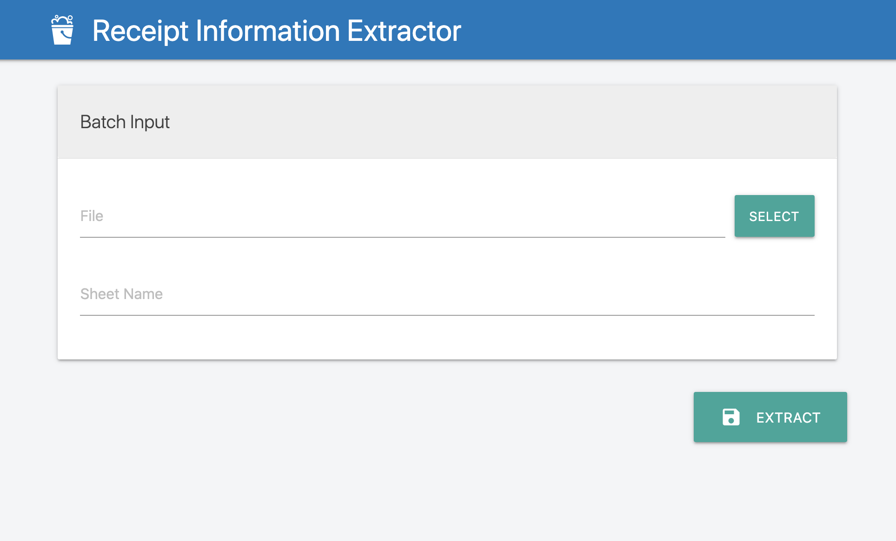

# Receipt Information Extraction using LayoutLM

## Introduction

This repository is an attempt to implement Microsoft's [LayoutLM](https://arxiv.org/abs/1912.13318) model on the SROIE2019 dataset of receipts. The foucs of this project is specifically on Task 3 of [ICDAR 2019 Robust Reading Challenge on Scanned Receipts OCR and Information Extraction](https://rrc.cvc.uab.es/?ch=13), which is extracting key information, specifically the company, address, date, and total, from scanned receipts.

## Approach

This repository approaches the problem as a token classification problem. For each word on the scanned receipt image, the model will attempt to classify whether it is part of the company, address, date, or total sequence. If it doesn't belong to any of these fields, we want to classify it as "Other". At the end, we will sequence all the words with the same class together to produce the complete extracted fields.

An example of the same problem executed on a different dataset can be found in [LayoutLM's own repository](https://github.com/microsoft/unilm/tree/master/layoutlm/examples/seq_labeling).

## Dataset

Thanks to [zzzDavid's repository](https://github.com/zzzDavid/ICDAR-2019-SROIE) on the same topic, I was able to get the dataset


[Google Drive](https://drive.google.com/drive/folders/1ShItNWXyiY1tFDM5W02bceHuJjyeeJl2) | [Baidu NetDisk](https://pan.baidu.com/s/1a57eKCSq8SV8Njz8-jO4Ww#list/path=%2FSROIE2019&parentPath=%2F)

## Data cleaning/preprocessing
A big problem of this dataset is that it is not in the form that can be readily put into the model. These include:
1. OCR result is provided at line-level(meaning that the bounding boxes are of an entire line) while the model requires token-level OCCR
2. Dataset doesn't provide token-level labels

From a process of trials and errors, I'll outline the process I take to clean and preprocess the data to be put into the model. For the first problems, I will process the line-level OCR provided by the data to get the token-level bounding box for each word. Some observations:

- most of the font used are monospaced, meaning that every character in that font family has the same size.
- words on the same line usually have the same font and size

From these two observation, we will make the assumption that all characters (including space) on the same line have the same size. Therefore, we can calculate the width of one character from the width of the bounding box of the line. From this, we can calculate the width of the bounding box for each word based on how many chacracters that word consist of. Of course, this will not produce the ground truth OCR for every word (example shown below). However, the bounding boxes relative position is good enough since what we ultimately want is the word's relative 2D position in the scanned image.

For the second problem, the process to clean the data is a bit more complicated involves some manual labelling. For each image, I assume that all words in one line belongs to the same field. If a line contains one of the extracted information field as a substring or vice versa, I (programmatically) label that entire line with that field's name. This assumption is far more problematic than the other and resulted in a lot of mislabelled data. I recorded all the mismatched label in a text file and fixed them manually in the label file.

The code to clean/preprocess the data as outlined is in preprocess_receipt.py. Before you can run the script, you will need to download the data into `/data`, split the data up into 3 folders, namely `images/`, `annotations/`, and `extract/` which contain the images, their OCR result, and their extracted information respectively. You will also need to change extracted information files' extention from `.txt` into `.json` (this can be done programmatically using Python.You can rename the file to the appropriate extension without corrupting the file). I have done the honor of cleaning the first 22,000 words and putting them into formatted `.txt` files. You can use these files to train and test the model yourself following the instruction of the `Sequence Labelling` task mentioned as one of the example in [LayoutLM's own repository](https://github.com/microsoft/unilm/tree/master/layoutlm#sequence-labeling-task).

## Training
We will follow the same training procedure outlined in [LayoutLM Sequence Labelling example](https://github.com/microsoft/unilm/tree/master/layoutlm#sequence-labeling-task) with the `.txt` files we have created. These files can be found under [`/data`](/data) in this repostiory.

## Result
With relatively few training (~20000 words and bounding boxes), the model is able to achieve **~91.5%** token-level accuracy on a ~2000-word test set. We can use the classification result and sequence the words of the same class back together for to get the full extracted information for each receipt.

## Model 
The trained model can be found [here](https://drive.google.com/drive/folders/1nXMH5rUKHLOmt2IrIeauMBfonmtzCRk7?usp=sharing).

## Demo

This repository also contains a simple flask application to demonstrate the power of this model. The application will take the words and their bounding boxes from a collection of receipt images and put the extracted information (from our model) into a google sheet. In a real world scenario, this Excel sheet can be processed further, eliminating the need for manual data entry.

### Installation
1. Clone this repository

```
git clone https://github.com/thongn98/receipt-information-extraction.git
```
2. Make a virtual environment and activate it

You will need to navigate to where you want to put the environment files.

```
python3 -m venv [ENV-NAME]
source [ENV-NAME]/bin/activate
```

3. Install requirements

Navigate back to this repository folder
```
pip install -r requirements.txt
```
4. Install LayoutLM

Clone the LayoutLM repository
```
git clone https://github.com/microsoft/unilm.git
```

5. Install LayoutLM
```
pip install unilm/layoutlm
```
6. Download `credentials.json` file for Google Sheet API. You can find the instruction to do so [here](https://developers.google.com/sheets/api/quickstart/python). You'll need to move this credentials file into this repository root folder
7. Create a folder for the model inside the repository root folder
```
mkdir model/
```
7. Download the model from the link above and put all the files there into `model/`
5. Run flask app

```
python view.py
```

This will open port 5000 on your local machine. You can try out the application out by going to `http://127.0.0.1:5000/` on your browser. You can use the `/data/test_image.txt` as the input with some sheet name to your choosing. The app will process the `.txt` file and give back the Google Sheet URL with the extracted information. The UI of this application looks like this




## File Structure

### [`preprocess.py`](/preprocess.py)

This file is responsible for preprocessing the input data

### [`predict.py`](/predict.py)

This file is responsible for predicting the labels for the input data

### [`helpers.py`](/helpers.py)

This file is responsible for defining all miscellaneous helper functions

### [`sheet_helpers.py`](/sheet_helpers.py)

This file is responsible for defining all the helper functions related to Google Sheet API.

### [`view.py`](/view.py)

This file is responsible for defining all the flask application views

### [`preprocess_receipt.py`](/preprocess_receipt.py)

This file is responsible for preprocessing the original data into `.txt` file for the model to train/predict

### [`template/`](/template/)

This folder contains all the assets for the flask application
